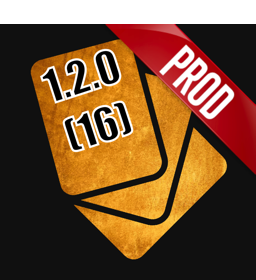
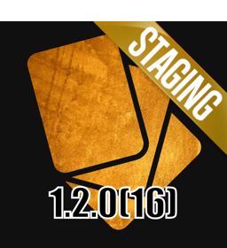
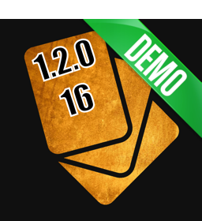
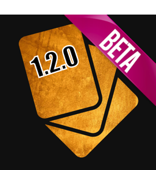
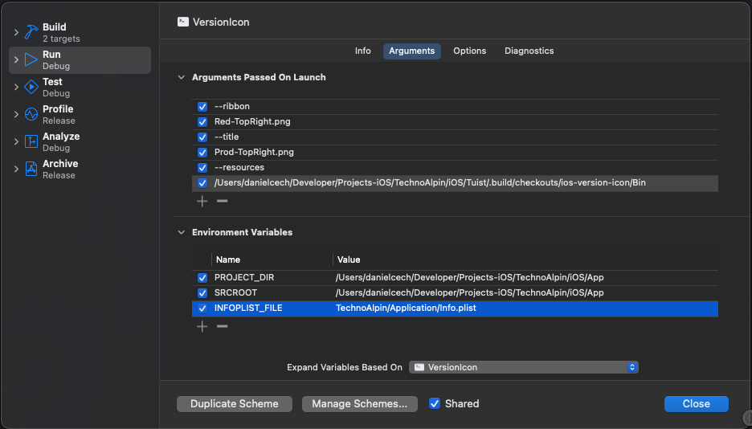

[](https://github.com/strvcom/ios-version-icon/tags)
[](LICENSE)
[](https://swift.org/package-manager/)

<p align="center">
    
</p>

# VersionIcon

VersionIcon adds an overlay to your iOS app icon showing the build variant and the app version. The overlay can include a ribbon with the build variant (_Devel_, _Staging_, _Production_…), the version and build number, or both. You can customize the overlay in many ways or supply your own graphics. VersionIcon ships as a prebuilt binary, so it doesn't depend on how your project is set up.

## Contents

- [Requirements](#requirements)
- [Installation](#installation)
- [Usage](#usage)
  - [Full example](#full-example)
  - [Generated asset catalog mode](#generated-asset-catalog-mode)
- [Parameters](#parameters)
- [Examples](#examples)
- [Debugging](#debugging)
- [Contributing](#contributing)
- [Author](#author)
- [License](#license)

## Requirements

- macOS 10.15+
- Xcode 12+ (Swift 5.2+)
- An iOS app whose app icon lives in an asset catalog

## Installation

VersionIcon is distributed as a Swift package. Add the package to your project. In Xcode, choose **File › Add Package Dependencies…** and enter the URL, or add it in `Package.swift`:

```swift
.package(url: "https://github.com/strvcom/ios-version-icon.git", from: "1.2.3")
```

The package ships a prebuilt `VersionIcon` binary and its resources in the `Bin` folder of the package checkout. Point your Run Script phase at that folder:

| Setup | `Bin` folder path in the Run Script phase |
| --- | --- |
| Xcode package dependency | `"${BUILD_DIR%/Build/*}/SourcePackages/checkouts/ios-version-icon/Bin"` |
| [Tuist](https://tuist.io) (`Tuist/Package.swift`) | `"${SRCROOT}/../Tuist/.build/checkouts/ios-version-icon/Bin"` |

## Usage

1. **Duplicate your app icon** in the asset catalog, so you have `AppIcon` and `AppIconOriginal`:
   - `AppIconOriginal` is the clean source image. VersionIcon only reads it and never changes it.
   - `AppIcon` stays the target's app icon (**Primary App Icon Set Name**). VersionIcon overwrites its images on every build: with the overlay for development builds, or with the clean original when you pass `--original` for production builds.

   Keep the same entries (size, scale, idiom, platform and appearance, such as Dark and Tinted variants) in both sets. VersionIcon skips any entry that's in only one of them and prints a warning. If your icon sets have other names, pass them with `--appIcon` and `--appIconOriginal`. The names must be unique in the project, because VersionIcon uses the first `.appiconset` folder it finds with each name.
2. **Add a Run Script phase** in your target's **Build Phases** and paste the script below.
3. **Move the phase above Copy Bundle Resources** so the icon is generated before it's copied into the app.

VersionIcon reads the icon entries from the `Contents.json` of both icon sets, so it works with modern single-size asset catalogs as well as legacy multi-size ones.

```shell
VERSION_ICON_PATH="${BUILD_DIR%/Build/*}/SourcePackages/checkouts/ios-version-icon/Bin"

if [ "${CONFIGURATION}" = "Release" ]; then
    "$VERSION_ICON_PATH/VersionIcon" --resources "$VERSION_ICON_PATH" --original
else
    "$VERSION_ICON_PATH/VersionIcon" --resources "$VERSION_ICON_PATH" \
        --ribbon Blue-TopRight.png --title Devel-TopRight.png --on-error warn
fi
```

If your project uses other configuration names, adjust the conditions. To use your own ribbon or title artwork, pass an absolute path to a `.png` file.

### Full example

This is the setup used by the JustFlip app shown above, which installs VersionIcon through Tuist. It uses one ribbon per environment, a rotated two-line version label, and no overlay on the App Store build:

```shell
VERSION_ICON_PATH="$SRCROOT/../Tuist/.build/checkouts/ios-version-icon/Bin"
OUTPUT_ASSET_CATALOG="$SRCROOT/JustFlip/Application/Resources/VersionIconGenerated.xcassets"
COMMON_ARGS=(--appIcon "AppIcon-${CONFIGURATION}" --appIconOriginal AppIconOriginal \
    --outputAssetCatalog "$OUTPUT_ASSET_CATALOG" --resources "$VERSION_ICON_PATH")
STYLE_ARGS=(--titleSize 0.17 --fillColor "#000000" --strokeColor "#FFFFFF" --strokeWidth 0.05 \
    --titleRotation 18 --horizontalTitlePosition 0.35 --verticalTitlePosition 0.7 \
    --versionStyle parenthesisTwoLines)

case "${CONFIGURATION}" in
    "Production-Release")
        "$VERSION_ICON_PATH/VersionIcon" "${COMMON_ARGS[@]}" --original ;;
    "Production-Debug")
        "$VERSION_ICON_PATH/VersionIcon" "${COMMON_ARGS[@]}" --ribbon Red-TopRight.png --title Prod-TopRight.png "${STYLE_ARGS[@]}" ;;
    "Staging-"*)
        "$VERSION_ICON_PATH/VersionIcon" "${COMMON_ARGS[@]}" --ribbon Gold-TopRight.png --title Staging-TopRight.png "${STYLE_ARGS[@]}" ;;
    "Development-"*)
        "$VERSION_ICON_PATH/VersionIcon" "${COMMON_ARGS[@]}" --ribbon Blue-TopRight.png --title Devel-TopRight.png "${STYLE_ARGS[@]}" ;;
    *)
        echo "error: VersionIcon does not recognize CONFIGURATION '${CONFIGURATION}'"
        exit 1 ;;
esac
```

### Generated asset catalog mode

By default, VersionIcon writes the generated images into the `--appIcon` icon set in your sources, so every build changes tracked files. For new projects, add `--outputAssetCatalog` so your source assets stay unchanged:

```shell
"$VERSION_ICON_PATH/VersionIcon" \
    --appIcon "AppIcon-${CONFIGURATION}" \
    --appIconOriginal AppIconOriginal \
    --outputAssetCatalog "${SRCROOT}/VersionIconGenerated.xcassets" \
    --resources "$VERSION_ICON_PATH" \
    --ribbon Blue-TopRight.png \
    --title Devel-TopRight.png \
    --on-error warn
```

- VersionIcon creates the catalog and its icon sets as needed. The output catalog must be separate from the one that holds `AppIconOriginal`.
- Add `VersionIconGenerated.xcassets` to the target's **Copy Bundle Resources** phase, and keep the VersionIcon phase before it.
- Set the target's **Primary App Icon Set Name** (`ASSETCATALOG_COMPILER_APPICON_NAME`) to `AppIcon-$(CONFIGURATION)`. Using a separate icon name per configuration means switching configurations doesn't overwrite another configuration's generated files.
- The generated catalog is a build artifact. Add `VersionIconGenerated.xcassets/*.appiconset/` to `.gitignore`.

## Parameters

Run `VersionIcon --help` for the full list.

#### Ribbon

| Parameter | Description | Default |
| --- | --- | --- |
| `--ribbon <file>` | Ribbon image. `Bin/Ribbons` contains ribbons in six colors (`Blue`, `Cyan`, `Gold`, `Green`, `Purple`, `Red`) for every corner (`TopLeft`, `TopRight`, `BottomLeft`, `BottomRight`). You can also pass an absolute path to your own `.png`. | none |
| `--title <file>` | Title image placed on the ribbon. `Bin/Titles` has `Alpha`, `Beta`, `Debug`, `Demo`, `Dev`, `Devel`, `MVP`, `Prod` and `Staging` for every corner, e.g. `Devel-TopRight.png`. You can also pass an absolute path to your own `.png`. Titles are transparent images; custom text isn't supported yet. | none |

#### Version label

| Parameter | Description | Default |
| --- | --- | --- |
| `--versionStyle <style>` | Format of the version label: `dash` (`1.2.0 - 16`), `parenthesis`, `parenthesisTwoLines`, `twoLines`, `versionOnly`, `buildOnly` or `empty`. See [Examples](#examples). | `dash` |
| `--fillColor <#RRGGBB>` | Text fill color. | `#FFFFFF` |
| `--strokeColor <#RRGGBB>` | Text stroke color. | `#000000` |
| `--strokeWidth <ratio>` | Stroke width as a fraction of the icon width. | `0.03` |
| `--font <name>` | Font of the label. | `Impact` |
| `--titleSize <ratio>` | Text size as a fraction of the icon width. | `0.25` |
| `--horizontalTitlePosition <ratio>` | Horizontal center of the label as a fraction of the icon width, measured from the left edge. | `0.5` |
| `--verticalTitlePosition <ratio>` | Vertical center of the label as a fraction of the icon height, measured from the bottom edge. | `0.2` |
| `--titleRotation <degrees>` | Label rotation, from `-180` to `180`. | `0` |
| `--titleAlignment <alignment>` | `left`, `center` or `right`. | `center` |

#### Script setup

| Parameter | Description | Default |
| --- | --- | --- |
| `--resources <path>` | The package's `Bin` folder, which contains `Ribbons` and `Titles`. | required |
| `--appIcon <name>` | Icon set that VersionIcon writes to. By default it must already exist in the project and be the target's app icon. With `--outputAssetCatalog`, VersionIcon creates it inside that catalog. | `AppIcon` |
| `--appIconOriginal <name>` | Source icon set with the clean images. VersionIcon only reads it. | `AppIconOriginal` |
| `--outputAssetCatalog <path>` | Optional `.xcassets` folder for the generated icon. See [Generated asset catalog mode](#generated-asset-catalog-mode). | none |
| `--original` | Copy the clean images from `--appIconOriginal` into `--appIcon` without any overlay, typically for production builds. | off |
| `--on-error <fail\|warn>` | `fail` stops the build when VersionIcon fails; `warn` prints the error and lets the build continue. | `fail` |
| `--help` | Print all parameters. | |

## Examples

The icons below are from the JustFlip app (version `1.2.0`, build `16`). They all share these arguments:

```shell
COMMON=(--resources "$VERSION_ICON_PATH" --titleSize 0.17 \
    --fillColor "#000000" --strokeColor "#FFFFFF" --strokeWidth 0.05)
HORIZONTAL=(--horizontalTitlePosition 0.5 --verticalTitlePosition 0.2)
ROTATED=(--titleRotation 18 --horizontalTitlePosition 0.35 --verticalTitlePosition 0.7)
```

Each icon adds its own ribbon, title, label layout and `--versionStyle`. For example, the first one is:

```shell
"$VERSION_ICON_PATH/VersionIcon" "${COMMON[@]}" "${HORIZONTAL[@]}" \
    --ribbon Blue-TopRight.png --title Devel-TopRight.png --versionStyle dash
```

<table>
  <tr>
    <td valign="top">
      <p align="center"><br /><b><code>dash</code></b></p>

```shell
--ribbon Blue-TopRight.png
--title Devel-TopRight.png
"${HORIZONTAL[@]}"
```

</td>
    <td valign="top">
      <p align="center"><br /><b><code>parenthesis</code></b></p>

```shell
--ribbon Gold-TopRight.png
--title Staging-TopRight.png
"${HORIZONTAL[@]}"
```

</td>
  </tr>
  <tr>
    <td valign="top">
      <p align="center"><br /><b><code>parenthesisTwoLines</code></b></p>

```shell
--ribbon Red-TopRight.png
--title Prod-TopRight.png
"${ROTATED[@]}"
```

</td>
    <td valign="top">
      <p align="center"><br /><b><code>twoLines</code></b></p>

```shell
--ribbon Green-TopRight.png
--title Demo-TopRight.png
"${ROTATED[@]}"
```

</td>
  </tr>
  <tr>
    <td valign="top">
      <p align="center"><br /><b><code>versionOnly</code></b></p>

```shell
--ribbon Purple-TopRight.png
--title Beta-TopRight.png
"${ROTATED[@]}"
```

</td>
    <td valign="top">
      <p align="center"><br /><b><code>buildOnly</code></b></p>

```shell
--ribbon Cyan-TopRight.png
--title MVP-TopRight.png
"${ROTATED[@]}"
```

</td>
  </tr>
  <tr>
    <td valign="top">
      <p align="center"><br /><b><code>empty</code></b></p>

```shell
--ribbon Blue-TopRight.png
--title Devel-TopRight.png
"${ROTATED[@]}"
```

</td>
  </tr>
</table>

## Debugging

To change VersionIcon and debug it against your own project, set up the VersionIcon scheme like this:

- **Arguments Passed On Launch:** copy the parameters from your project's VersionIcon build phase.
- **Environment Variables:** set `SRCROOT`, `PROJECT_DIR` and `INFOPLIST_FILE`. You can find their values in the build log in Xcode's Report navigator.

<p align="center">
    
</p>

## Contributing

Issues and pull requests are welcome!

## Author

Daniel Čech ([GitHub](https://github.com/DanielCech))

## License

VersionIcon is released under the MIT license. See [LICENSE](LICENSE) for details.
